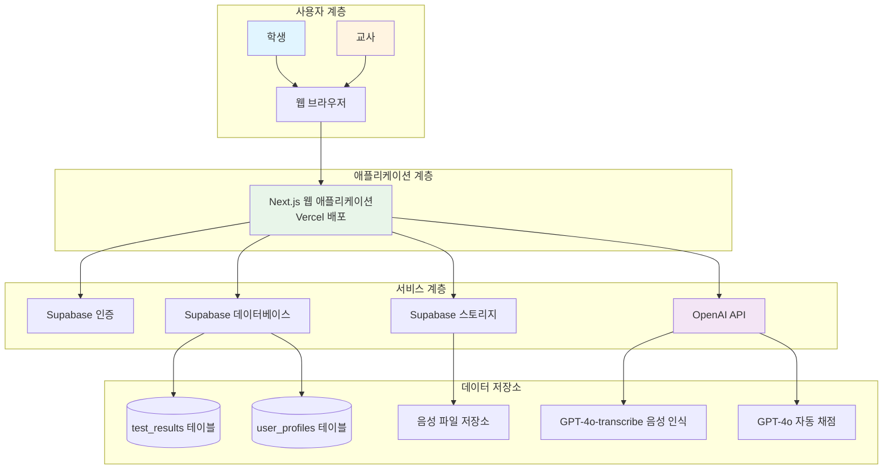
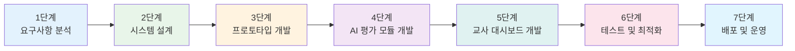
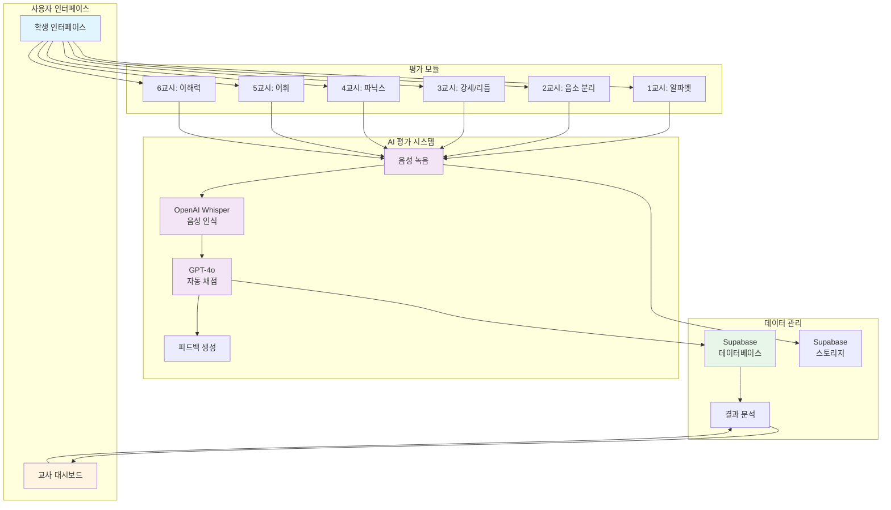
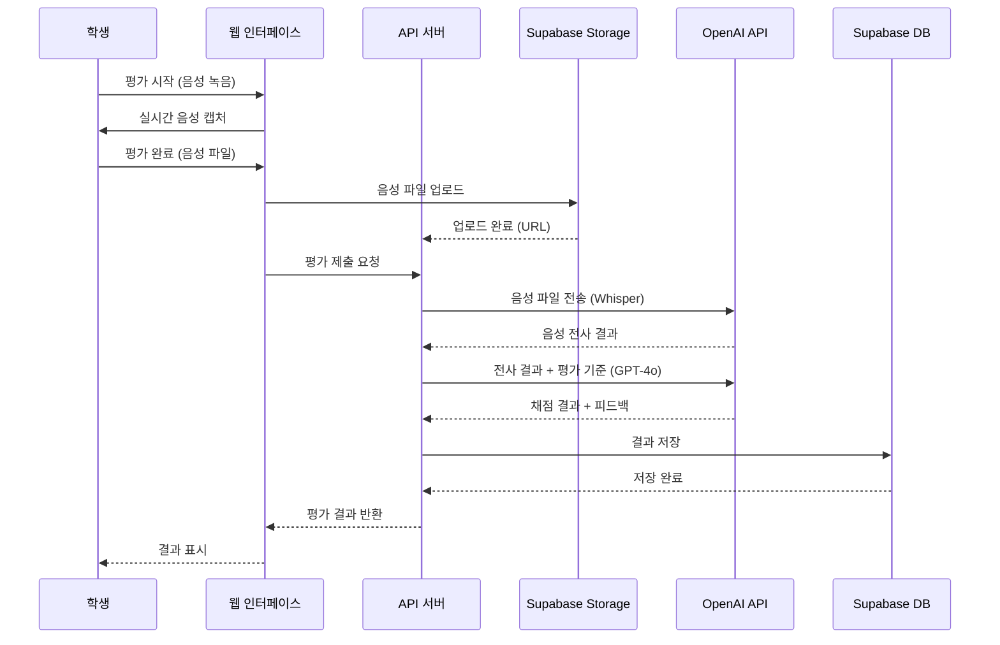
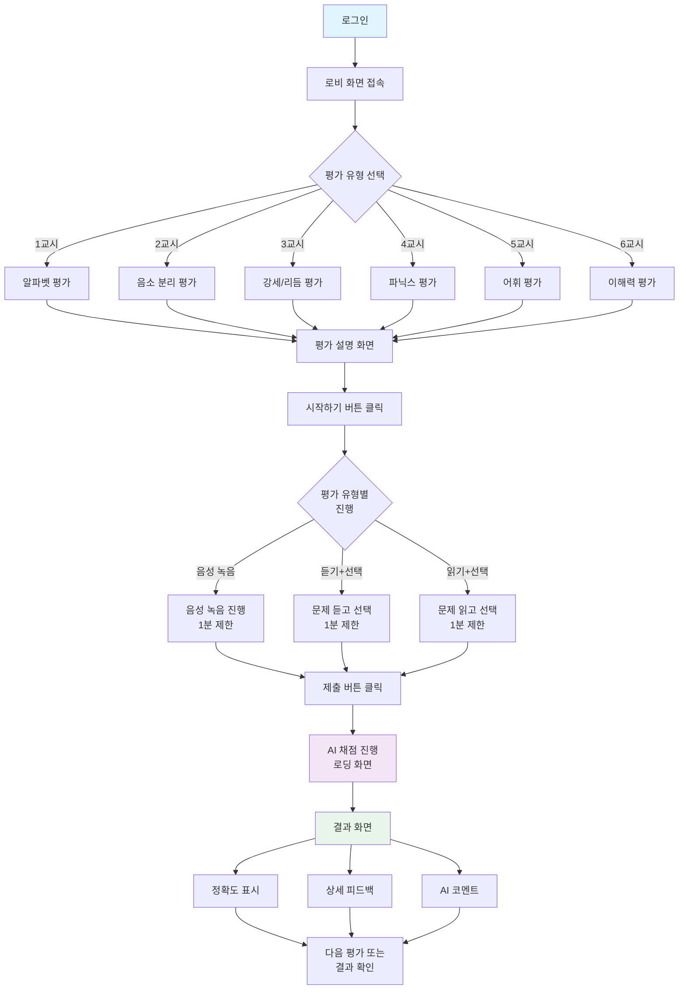
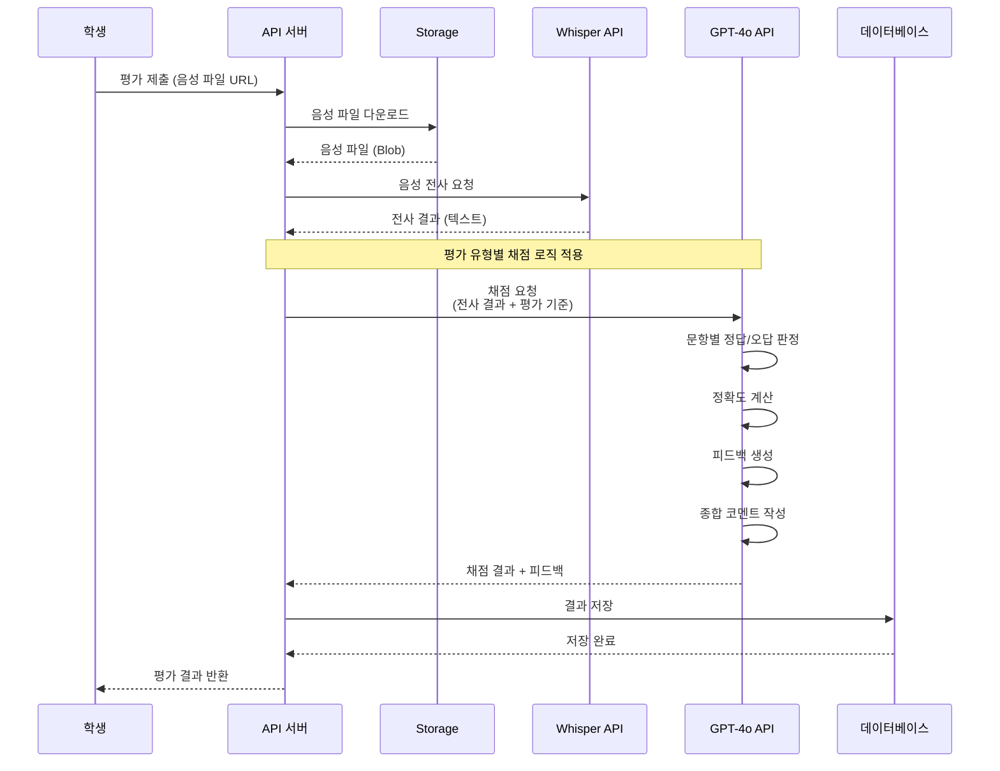
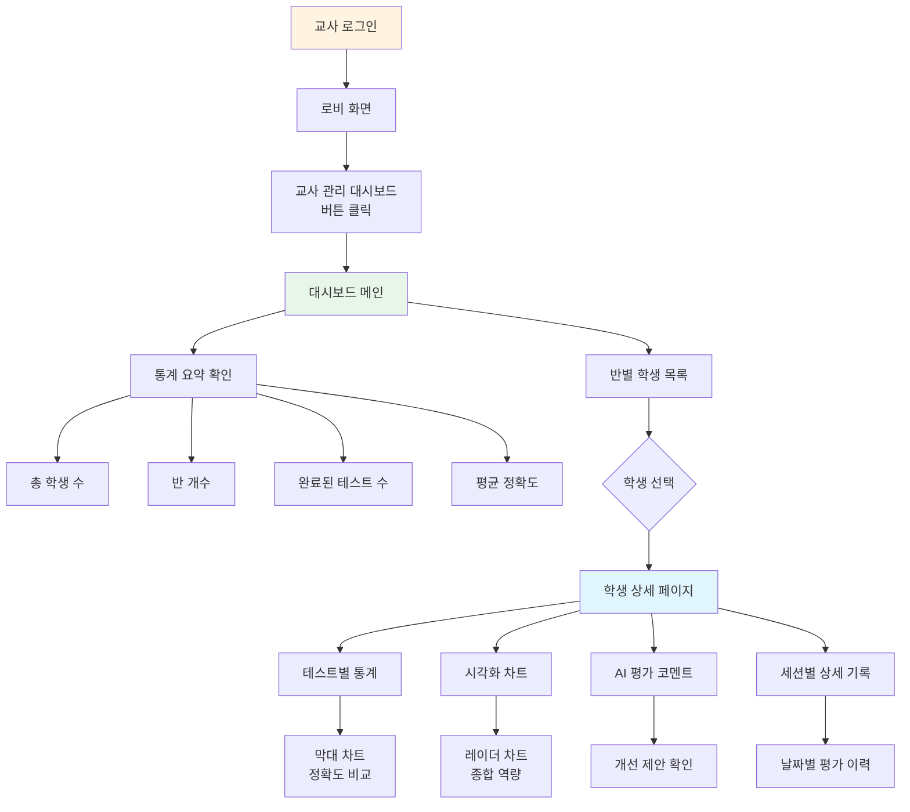

# Ⅲ. AI 초등영어 기초학력 진단 플랫폼 개발

**작성자**: 김민제  
**작성일**: 2025년 1월  
**버전**: 1.0

---

## 1. 진단 플랫폼 개발 개요

### 1.1 플랫폼 개요

AI 초등영어 기초학력 진단 플랫폼(AIDTPEL: AI-based Diagnostic Test for Primary English Literacy)은 국가기초학력지원센터에서 설정한 초등학교 3~4학년군 영어과 최소한의 성취기준(이해)을 바탕으로 구축된 AI 기반 영어 읽기 능력 진단 평가 시스템입니다. 

본 플랫폼은 인공지능 기술을 활용하여 학생들의 영어 읽기 능력을 자동으로 평가하고 분석하며, 교사가 학생들의 학습 진도를 체계적으로 관리할 수 있도록 지원합니다. 특히 비영어권(EFL) 환경인 한국의 교육 현실에 최적화되어, 학생들의 발음 특성을 반영한 정확한 평가가 가능합니다.

#### 시스템 전체 개요 다이어그램

**그림 1. 시스템 전체 구조도**

시스템은 사용자 계층, 애플리케이션 계층, 서비스 계층, 데이터 저장소로 구성되어 있습니다. 학생과 교사는 웹 브라우저를 통해 플랫폼에 접근하며, Next.js 기반 웹 애플리케이션이 모든 요청을 처리합니다. Supabase는 인증, 데이터베이스, 스토리지 서비스를 제공하고, OpenAI API는 음성 인식 및 자동 채점 기능을 담당합니다.

### 1.2 개발 배경 및 목적

#### 1.2.1 개발 배경

기존 영어 읽기 평가 방식은 다음과 같은 한계를 가지고 있었습니다:

1. **시간 소모**: 교사가 일일이 학생의 발음을 듣고 평가해야 하며, 학생당 15~20분의 시간이 소요됩니다.
2. **일관성 부족**: 교사의 주관적 판단과 피로도에 따라 평가 결과가 달라질 수 있습니다.
3. **진도 추적 어려움**: 엑셀 수기 입력이나 수동 분석에 많은 시간이 소요됩니다.
4. **EFL 환경 미최적화**: 기존 평가 도구들은 원어민 발음 기준으로 설계되어 한국 학생들에게 부적합합니다.

#### 1.2.2 개발 목적

본 플랫폼은 다음과 같은 목적을 가지고 개발되었습니다:

1. **자동화된 평가 시스템 구축**: AI 음성 인식 및 자동 채점을 통해 평가 시간을 90% 이상 단축합니다.
2. **객관적이고 일관된 평가**: AI 기반 평가로 주관성을 제거하고 일관된 평가 결과를 제공합니다.
3. **효율적인 학습 진도 관리**: 교사 대시보드를 통해 모든 학생의 평가 결과를 한눈에 확인하고 분석할 수 있습니다.
4. **EFL 환경 최적화**: 한국 학생들의 발음 특성을 반영한 평가 시스템을 구현합니다.

### 1.3 평가 기준

본 플랫폼은 **국가기초학력지원센터에서 설정한 초등학교 3~4학년군 영어과 최소한의 성취기준(이해)**을 바탕으로 개발되었습니다. 

6가지 최소 성취기준은 다음과 같이 단계적으로 구성되어 있습니다:

1. **알파벳 이름 말하기**: 알파벳 대소문자 인식 능력
2. **음소 분리**: 최소대립쌍을 통한 음소 구분 능력
3. **강세 및 리듬 패턴**: 단어의 강세와 리듬 인식 능력
4. **파닉스 읽기**: 파닉스 규칙 적용 및 읽기 유창성
5. **의미 이해**: 단어, 어구, 문장의 의미 파악 능력
6. **주요 정보 파악**: 듣기/읽기 내용의 핵심 정보 이해 능력

### 1.4 개발 절차

플랫폼 개발은 다음과 같은 단계로 진행되었습니다:

**그림 2. 개발 절차 단계별 프로세스**

#### 1.4.1 1단계: 요구사항 분석 (2025년 10월 초)

- 교육 현장의 평가 문제점 조사 및 분석
- 국가기초학력지원센터 최소 성취기준 검토
- 사용자(학생, 교사) 니즈 파악
- 기술 요구사항 정의

#### 1.4.2 2단계: 시스템 설계 (2025년 10월 중순)

- 시스템 아키텍처 설계
- 데이터베이스 스키마 설계
- API 엔드포인트 설계
- 사용자 인터페이스(UI/UX) 디자인

#### 1.4.3 3단계: 프로토타입 개발 (2025년 10월 중순~말)

- Next.js 프로젝트 초기 설정
- 기본 인증 시스템 구축
- 6가지 평가 유형 기본 구조 구현
- 음성 녹음 기능 구현

#### 1.4.4 4단계: AI 평가 모듈 개발 (2025년 10월 말~11월 초)

- OpenAI Whisper API 연동 (음성 인식)
- GPT-4o API 연동 (자동 채점)
- 평가 유형별 채점 로직 구현
- EFL 환경 최적화 (한국 발음 보정)

#### 1.4.5 5단계: 교사 대시보드 개발 (2025년 11월 중순)

- 교사 관리 시스템 구축
- 학생-교사 관계 매핑
- 통계 및 차트 시각화
- AI 기반 종합 평가 코멘트 생성

#### 1.4.6 6단계: 테스트 및 최적화 (2025년 11월 말)

- 기능 테스트
- 성능 최적화
- 보안 검증 (RLS 정책 확인)
- 사용자 피드백 수집 및 반영

#### 1.4.7 7단계: 배포 및 운영 (2025년 12월~)

- Vercel 배포
- 운영 모니터링
- 지속적인 기능 개선

### 1.5 기술 선택 근거

#### 1.5.1 프론트엔드 기술 스택

**Next.js 15 + React 19 + TypeScript**
- **선택 근거**: 
  - 서버 사이드 렌더링(SSR)을 통한 빠른 초기 로딩 속도
  - 서버 컴포넌트를 활용한 성능 최적화
  - 타입 안정성을 통한 개발 생산성 향상
  - 풍부한 생태계와 커뮤니티 지원

#### 1.5.2 백엔드 및 데이터베이스

**Next.js API Routes + Supabase**
- **선택 근거**:
  - 서버리스 아키텍처로 확장성 및 비용 효율성 확보
  - Supabase의 PostgreSQL 데이터베이스는 복잡한 쿼리 및 관계형 데이터 관리에 적합
  - Row Level Security(RLS)를 통한 보안 강화
  - 인증, 스토리지 등 통합 서비스 제공

#### 1.5.3 AI 기술

**OpenAI Whisper + GPT-4o**
- **선택 근거**:
  - Whisper API는 95% 이상의 정확한 음성 인식 성능
  - GPT-4o는 맥락을 이해한 지능형 채점 가능
  - 다국어 지원으로 한국 발음 혼합 응답 처리 가능
  - 안정적인 API 서비스 제공

#### 1.5.4 배포 및 인프라

**Vercel**
- **선택 근거**:
  - Next.js와의 완벽한 통합
  - 자동 배포 및 스케일링
  - 글로벌 CDN을 통한 빠른 콘텐츠 전송
  - 개발자 친화적인 배포 프로세스

---

## 2. 진단 플랫폼 체계 및 구성 요소

### 2.1 플랫폼 전체 체계

본 플랫폼은 크게 **평가 모듈**, **AI 평가 시스템**, **교사 관리 시스템**, **데이터 관리 시스템**으로 구성되어 있습니다.

#### 시스템 아키텍처 다이어그램

**그림 3. 플랫폼 시스템 아키텍처**

플랫폼은 사용자가 평가를 진행하면, 음성 데이터를 수집하고 AI 시스템이 자동으로 인식 및 채점한 후, 결과를 데이터베이스에 저장합니다. 교사는 대시보드를 통해 저장된 데이터를 분석하고 학생들의 학습 진도를 확인할 수 있습니다.

### 2.2 데이터 흐름

#### 평가 프로세스 데이터 흐름도

**그림 4. 평가 프로세스 데이터 흐름**

학생이 평가를 완료하면 음성 파일이 Supabase Storage에 업로드되고, OpenAI Whisper API를 통해 음성이 텍스트로 전사됩니다. 전사된 텍스트는 GPT-4o를 통해 채점되고, 결과는 데이터베이스에 저장되어 즉시 학생에게 반환됩니다.

### 2.3 구성 요소 상세

#### 2.3.1 6가지 최소 성취기준 평가 유형

본 플랫폼은 국가기초학력지원센터에서 설정한 초등학교 3~4학년군 영어과 최소한의 성취기준(이해)에 기반한 6가지 평가 유형을 제공합니다.

##### 1교시: 알파벳 이름 말하기 (Alphabet)

- **평가 목적**: 알파벳 대소문자 이름 인식 속도 및 정확도 평가
- **평가 방식**: 음성 녹음 (학생이 화면에 표시된 알파벳 이름을 읽음)
- **제한 시간**: 1분 (60초)
- **문항 구성**: 총 52개 알파벳 (대문자 26개, 소문자 26개)을 섞인 순서로 제시
- **평가 내용**: 
  - 알파벳 이름을 정확히 읽는 능력
  - 대소문자 구분 능력
  - 읽기 속도

##### 2교시: 음소 분리 (Segmental Phoneme)

- **평가 목적**: 비슷한 소리를 듣고 구분하는 능력 평가
- **평가 방식**: 듣기 + 선택 (두 단어 중 들려준 단어 선택)
- **제한 시간**: 1분 (60초)
- **문항 구성**: 총 20개 최소대립쌍 (예: fine/five, big/pig)
- **평가 내용**:
  - 최소대립쌍(minimal pair)을 통한 음소 구분 능력
  - 한국인이 헷갈려하는 음가(b/v, b/p, p/f, r/l 등) 구분

##### 3교시: 강세 및 리듬 패턴 (Suprasegmental Phoneme)

- **평가 목적**: 단어의 강세 패턴을 듣고 선택하는 능력 평가
- **평가 방식**: 듣기 + 선택 (강세 위치 선택)
- **제한 시간**: 1분 (60초)
- **문항 구성**: 총 20개 단어 (2음절 이상)
- **평가 내용**:
  - 단어의 강세 위치 인식 (예: APple, banANa)
  - 영어의 리듬 패턴 이해

##### 4교시: 파닉스 읽기 (Phonics)

- **평가 목적**: 파닉스 규칙 적용 및 읽기 유창성 평가
- **평가 방식**: 음성 녹음 (학생이 읽음)
- **제한 시간**: 1분 (60초)
- **문항 구성**: 3단계로 구성
  1. NWF (Nonsense Word Fluency): 무의미 단어 5개
  2. WRF (Word Reading Fluency): 실제 단어 5개
  3. ORF (Oral Reading Fluency): 문장 5개
- **평가 내용**:
  - 파닉스 규칙 적용 능력
  - 단어 읽기 유창성
  - 문장 읽기 유창성

##### 5교시: 의미 이해 (Vocabulary)

- **평가 목적**: 단어, 어구, 문장의 의미를 그림으로 선택하는 능력 평가
- **평가 방식**: 듣기/읽기 + 선택 (그림 선택)
- **제한 시간**: 1분 (60초)
- **문항 구성**: 동적 생성 (단어 → 어구 → 문장 순서로 순환 출제)
- **평가 내용**:
  - 단어 의미 이해
  - 어구 의미 이해
  - 문장 의미 이해
- **데이터 출처**: 천재교과서(함) - vocabulary_level.json, core_expressions.json

##### 6교시: 주요 정보 파악 (Comprehension)

- **평가 목적**: 말이나 대화를 듣고/읽고 한국어 질문에 맞는 답을 이미지로 선택하는 능력 평가
- **평가 방식**: 듣기/읽기 + 선택 (이미지 선택)
- **제한 시간**: 1분 (60초)
- **문항 구성**: 총 40개 문항 (말 또는 대화 형식)
- **평가 내용**:
  - 색깔과 크기 묘사 이해
  - 인물의 모습 묘사 이해
  - 주요 정보 파악 능력

#### 2.3.2 AI 평가 시스템

##### 음성 인식 모듈

- **기술**: OpenAI Whisper API (gpt-4o-transcribe 모델)
- **정확도**: 95% 이상
- **지원 언어**: 영어 (한국어 발음 혼합 지원)
- **처리 시간**: 평균 10~15초
- **주요 기능**:
  - 실시간 음성 녹음 (WebRTC 기반)
  - 음성 파일 전사
  - 다국어 지원

##### 자동 채점 모듈

- **기술**: OpenAI GPT-4o API
- **주요 기능**:
  - 문항별 정답/오답 판정
  - 정확도 계산 (0~100%)
  - 상세 피드백 생성
  - 종합 평가 코멘트 작성
- **처리 시간**: 평균 20~30초
- **특징**:
  - 평가 유형별 맞춤 채점 로직
  - EFL 환경 최적화 (한국 발음 특성 반영)
  - 맥락 이해를 통한 지능형 채점

#### 2.3.3 교사 관리 시스템

##### 교사 대시보드

- **통계 요약**:
  - 총 학생 수
  - 반 개수
  - 완료된 테스트 수
  - 평균 정확도
- **반별 학생 목록**: 반별로 그룹화된 학생 카드 표시
- **학생 정보**: 이름, 반, 번호, 완료율, 평균 정확도

##### 학생 상세 결과 페이지

- **학생 기본 정보**: 이름, 반, 번호, 학년
- **테스트별 통계**: 6가지 평가 유형별 시도 횟수, 평균 정확도
- **시각화 차트**:
  - 막대 차트: 테스트별 정확도 비교
  - 레이더 차트: 종합 역량 시각화
- **AI 평가 코멘트**: GPT-4o가 생성한 종합 평가 및 개선 제안
- **세션별 상세 기록**: 날짜별로 그룹화된 평가 이력

#### 2.3.4 성취기준 도달 판정 시스템

본 플랫폼은 국가기초학력지원센터의 최소 성취기준을 바탕으로 학생의 성취 수준을 판정하는 시스템을 제공합니다.

##### 혼합 판정 방식

성취기준 도달 여부는 절대 기준과 통계적 기준을 모두 고려하여 판정합니다.

- **절대 기준**: 각 영역별 70% 이상 달성
  - p1_alphabet (알파벳 이름 말하기): 70%
  - p2_segmental_phoneme (음소 분리): 70%
  - p3_suprasegmental_phoneme (강세 및 리듬 패턴): 70%
  - p4_phonics (파닉스 읽기): 70%
  - p5_vocabulary (의미 이해): 70%
  - p6_comprehension (주요 정보 파악): 70%

- **통계적 기준**: Z-score >= -1.0 (하위 16% 미만 제외)
  - 반 평균 및 표준편차를 기반으로 계산
  - 반 학생이 1명이거나 표준편차가 0인 경우 절대 기준만으로 판정
  - Z-score = (학생 정확도 - 반 평균) / 반 표준편차

- **종합 판정**: 절대 기준과 통계적 기준을 모두 만족해야 성취기준 도달로 판정
  - 절대 기준 미달: 성취기준 미도달
  - 절대 기준 달성 + 통계적 기준 미달: 성취기준 미도달
  - 절대 기준 달성 + 통계적 기준 달성: 성취기준 도달

##### 구현 위치

- 구현 파일: src/lib/achievement-standards.ts
- API 엔드포인트: /api/teacher/achievement-standards
- 주요 함수:
  - evaluateAchievement: 단일 영역 성취기준 판정
  - evaluateOverallAchievement: 모든 영역 종합 판정
  - calculateClassStatistics: 반 통계 계산

#### 2.3.5 전사 정확도 검토 시스템

AI 음성 인식 및 채점 시스템의 정확도를 검증하고 개선하기 위한 교사 검토 시스템입니다.

##### 목적

- AI 음성 인식(전사) 정확도 검증
- AI 채점 정확도 검증
- 시스템 개선을 위한 데이터 수집

##### 14가지 리뷰 유형

교사는 각 테스트 결과를 검토하여 다음 14가지 유형 중 하나를 선택합니다:

- 유형 1: 정답 발화 → 정확한 전사 → 정답
- 유형 2: 정답 발화 → 정확한 전사 → 오답
- 유형 3: 정답 발화 → 부정확한 전사 → 정답
- 유형 4: 정답 발화 → 부정확한 전사 → 오답
- 유형 5: 오답 발화 → 정확한 전사 → 정답
- 유형 6: 오답 발화 → 정확한 전사 → 오답
- 유형 7: 오답 발화 → 부정확한 전사 → 정답
- 유형 8: 오답 발화 → 부정확한 전사 → 오답
- 유형 9: 발화 없음 → 부정확한 전사 → 정답
- 유형 10: 발화 없음 → 부정확한 전사 → 오답
- 유형 11: 발화 수정 → 정확한 전사 → 정답
- 유형 12: 발화 수정 → 정확한 전사 → 오답
- 유형 13: 발화 수정 → 부정확한 전사 → 정답
- 유형 14: 발화 수정 → 부정확한 전사 → 오답

##### 통계 지표

- **음성 인식 정확도**: 정확한 전사를 한 경우의 비율
  - 계산 기준: 유형 1, 2, 5, 6, 11, 12
  - 공식: (정확한 전사 수 / 전체 리뷰 수) × 100

- **채점 정확도**: 최종 채점이 올바른 경우의 비율
  - 계산 기준: 유형 1, 3, 5, 7, 9, 11, 13
  - 공식: (올바른 채점 수 / 전체 리뷰 수) × 100

##### 구현 위치

- UI 페이지: src/app/teacher/transcription-accuracy/page.tsx
- API 엔드포인트:
  - /api/teacher/transcription-accuracy/statistics: 통계 조회
  - /api/teacher/transcription-accuracy/review: 리뷰 저장
- 데이터베이스 테이블: transcription_accuracy_reviews

#### 2.3.6 데이터베이스 구조

##### 주요 테이블

**1. test_results 테이블**
- 테스트 결과 저장
- 주요 컬럼: user_id, test_type, session_id, question, correct_answer, user_answer, is_correct, accuracy, audio_url, transcription_results

**2. user_profiles 테이블**
- 사용자 프로필 및 역할 관리
- 주요 컬럼: id, full_name, role (student/teacher), class_name, student_number, grade_level

**3. teacher_student_assignments 테이블**
- 교사-학생 관계 매핑
- 주요 컬럼: teacher_id, student_id, class_name

##### 보안 기능

- **Row Level Security (RLS)**: 모든 테이블에 RLS 활성화
  - 학생: 자신의 데이터만 조회 가능
  - 교사: 담당 학생의 데이터만 조회 가능
- **역할 기반 접근 제어**: 역할(role)에 따른 접근 권한 관리

---

## 3. 진단 플랫폼 작동 방법/예시 등

### 3.1 플랫폼 작동 방법

#### 3.1.1 학생 평가 프로세스

학생이 평가를 진행하는 전체 프로세스는 다음과 같습니다:

**그림 5. 학생 평가 프로세스 플로우차트**

학생은 로그인 후 원하는 평가 유형을 선택하고, 평가 설명을 확인한 뒤 평가를 시작합니다. 평가 유형에 따라 음성 녹음, 듣기+선택, 읽기+선택 방식으로 진행되며, 제출 후 AI가 자동으로 채점하여 결과를 제공합니다.

#### 3.1.2 AI 채점 프로세스

AI가 평가를 채점하는 상세 프로세스는 다음과 같습니다:

**그림 6. AI 채점 프로세스 시퀀스 다이어그램**

학생이 평가를 제출하면, 음성 파일이 OpenAI Whisper API로 전송되어 텍스트로 전사됩니다. 전사된 텍스트는 GPT-4o API로 전송되어 평가 유형별 채점 로직에 따라 정답/오답 판정, 정확도 계산, 피드백 생성이 수행됩니다. 최종 결과는 데이터베이스에 저장되고 학생에게 반환됩니다.

#### 3.1.3 성취기준 판정 프로세스

학생의 성취기준 도달 여부를 판정하는 프로세스는 다음과 같습니다:

1. **학생 정확도 수집**: 학생의 각 평가 유형별 최신 정확도를 수집합니다.

2. **반 통계 계산**: 동일 반 학생들의 평가 결과를 기반으로 다음을 계산합니다:
   - 반 평균 정확도
   - 반 표준편차
   - 학생 수

3. **절대 기준 판정**: 각 영역별로 학생의 정확도가 70% 이상인지 확인합니다.

4. **통계적 기준 판정**: 반 통계가 있는 경우 Z-score를 계산하여 -1.0 이상인지 확인합니다.
   - Z-score = (학생 정확도 - 반 평균) / 반 표준편차
   - 반 학생이 1명이거나 표준편차가 0인 경우 통계적 기준은 적용하지 않습니다.

5. **종합 판정**: 절대 기준과 통계적 기준을 모두 만족하는 영역을 성취기준 도달로 판정합니다.

6. **결과 생성**: 6가지 영역별 도달 여부와 전체 도달 영역 수를 계산하여 결과를 생성합니다.

**그림 8. 성취기준 판정 프로세스 플로우차트**
(한글 파일에 그림으로 삽입: 학생 정확도 수집 → 반 통계 계산 → 절대 기준 판정 → 통계적 기준 판정 → 종합 판정 → 결과 생성)

#### 3.1.4 전사 정확도 검토 프로세스

교사가 AI 음성 인식 및 채점 시스템의 정확도를 검토하는 프로세스는 다음과 같습니다:

1. **테스트 결과 조회**: 교사 대시보드에서 전사 정확도 검토 페이지에 접근합니다.

2. **오디오 재생 및 전사 확인**: 각 테스트 결과에 대해 다음을 확인합니다:
   - 학생의 실제 발화를 오디오로 재생하여 확인
   - AI가 전사한 텍스트 결과 확인
   - 최종 채점 결과 확인

3. **리뷰 유형 선택**: 14가지 리뷰 유형 중 해당하는 유형을 선택합니다.
   - 발화 정확도 (정답/오답/없음/수정)
   - 전사 정확도 (정확/부정확)
   - 채점 정확도 (정답/오답)

4. **메모 작성**: 필요시 추가 메모를 작성합니다.

5. **리뷰 저장**: 선택한 리뷰 유형과 메모를 데이터베이스에 저장합니다.

6. **통계 자동 계산**: 저장된 리뷰를 기반으로 다음 통계가 자동으로 계산됩니다:
   - 음성 인식 정확도
   - 채점 정확도
   - 리뷰 유형별 분포

7. **시스템 개선**: 수집된 데이터를 분석하여 AI 시스템 개선에 활용합니다.

**그림 9. 전사 정확도 검토 워크플로우**
(한글 파일에 그림으로 삽입: 테스트 결과 조회 → 오디오 재생 및 전사 확인 → 리뷰 유형 선택 → 메모 작성 → 리뷰 저장 → 통계 자동 계산 → 시스템 개선)

#### 3.1.5 교사 대시보드 활용

교사가 대시보드를 활용하는 프로세스는 다음과 같습니다:

**그림 7. 교사 대시보드 활용 프로세스**

교사는 대시보드에서 전체 통계를 확인하고, 반별로 그룹화된 학생 목록을 확인할 수 있습니다. 특정 학생을 선택하면 해당 학생의 상세 결과 페이지에서 테스트별 통계, 시각화 차트, AI 평가 코멘트, 세션별 상세 기록을 확인할 수 있습니다.

### 3.2 사용자 사용 방법

#### 3.2.1 학생 사용 가이드

##### 1단계: 로그인

1. 웹 브라우저에서 플랫폼 주소로 접속합니다.
2. 교사가 제공한 이메일과 비밀번호로 로그인합니다.
3. 로그인 성공 시 마법학교 테마의 로비 화면으로 이동합니다.

##### 2단계: 평가 선택

로비 화면에서 6가지 평가 유형 중 원하는 평가를 선택합니다:

- **1교시: 고대 룬 문자 해독 시험** - 알파벳 이름 말하기
- **2교시: 소리의 원소 분리 시험** - 음소 분리
- **3교시: 마법 리듬 패턴 시험** - 강세 및 리듬 패턴
- **4교시: 마법 주문 읽기 시험** - 파닉스 읽기
- **5교시: 마법서 그림 해석 시험** - 의미 이해
- **6교시: 고대 전설 이해 시험** - 주요 정보 파악

##### 3단계: 평가 진행

평가 유형에 따라 다음과 같이 진행합니다:

**음성 녹음 평가 (1교시, 4교시)**:
1. 평가 설명 화면을 확인합니다.
2. "시작하기" 버튼을 클릭합니다.
3. 화면에 표시된 내용을 읽으면서 마이크로 음성을 녹음합니다.
4. 1분 동안 최대한 많은 문제를 해결합니다.
5. "제출" 버튼을 클릭합니다.

**듣기 + 선택 평가 (2교시, 3교시)**:
1. 평가 설명 화면을 확인합니다.
2. "시작하기" 버튼을 클릭합니다.
3. "듣기" 버튼을 클릭하여 문제를 듣습니다.
4. 두 개의 선택지 중 정답을 선택합니다.
5. 1분 동안 최대한 많은 문제를 해결합니다.
6. "제출" 버튼을 클릭합니다.

**읽기 + 선택 평가 (5교시, 6교시)**:
1. 평가 설명 화면을 확인합니다.
2. "시작하기" 버튼을 클릭합니다.
3. 화면에 표시된 문제를 읽거나 "듣기" 버튼으로 듣습니다.
4. 여러 선택지 중 정답을 선택합니다.
5. 1분 동안 최대한 많은 문제를 해결합니다.
6. "제출" 버튼을 클릭합니다.

##### 4단계: 결과 확인

1. AI 채점이 진행되는 동안 잠시 기다립니다 (약 30초).
2. 결과 화면에서 다음 정보를 확인합니다:
   - **정확도**: 백분율로 표시
   - **정답/오답 개수**: 맞춘 문제와 틀린 문제 수
   - **상세 피드백**: 문항별 정답/오답 정보
   - **AI 코멘트**: 종합 평가 및 개선 제안
3. "결과 확인" 버튼을 클릭하면 세션별 평가 이력을 확인할 수 있습니다.

#### 3.2.2 교사 사용 가이드

##### 1단계: 교사 계정 설정

교사 계정은 시스템 관리자가 Supabase에서 직접 설정합니다:

1. Supabase 대시보드에서 교사 계정 생성
2. `user_profiles` 테이블에서 role을 'teacher'로 설정
3. 학생 프로필 생성 및 `teacher_student_assignments` 테이블에 교사-학생 매핑 설정

##### 2단계: 대시보드 접근

1. 교사 계정으로 로그인합니다.
2. 로비 화면에서 "🎓 교사 관리 대시보드" 버튼을 클릭합니다.
3. 대시보드 메인 화면으로 이동합니다.

##### 3단계: 전체 통계 확인

대시보드 메인 화면에서 다음 통계를 확인할 수 있습니다:

- **총 학생 수**: 담당하는 전체 학생 수
- **반 개수**: 관리하는 반의 개수
- **완료된 테스트 수**: 학생들이 완료한 총 테스트 수
- **평균 정확도**: 전체 학생의 평균 정확도

##### 4단계: 학생별 상세 분석

1. 반별 학생 목록에서 분석하고 싶은 학생의 카드를 클릭합니다.
2. 학생 상세 페이지에서 다음 정보를 확인합니다:

   **테스트별 통계 카드**:
   - 각 평가 유형(1교시~6교시)별 시도 횟수
   - 평균 정확도
   - 색상 코딩으로 성적 수준 시각화 (높음: 초록, 중간: 노랑, 낮음: 빨강)

   **시각화 차트**:
   - **막대 차트**: 6가지 평가 유형별 정확도를 막대 그래프로 비교
   - **레이더 차트**: 6가지 평가 영역의 종합 역량을 시각화하여 강점과 약점 파악

   **AI 평가 코멘트**:
   - GPT-4o가 생성한 종합 평가
   - 학생의 강점과 약점 분석
   - 개선 제안 및 학습 방향 안내

   **세션별 상세 기록**:
   - 날짜별로 그룹화된 평가 이력
   - 각 평가를 클릭하면 문항별 상세 결과 확인 가능
   - 시간에 따른 학습 진도 추이 파악

   **성취기준 도달 여부**:
   - 6가지 영역별 성취기준 도달 여부 표시
   - 절대 기준 달성 여부 (70% 이상)
   - 통계적 기준 달성 여부 (Z-score >= -1.0)
   - 종합 판정 결과 (도달/미도달)
   - 도달한 영역 수 및 전체 영역 수

##### 5단계: 전사 정확도 검토

1. 교사 대시보드에서 "전사 정확도 검토" 메뉴를 클릭합니다.
2. 검토할 테스트 유형을 선택합니다 (1교시 또는 4교시).
3. 날짜 범위를 설정하여 검토할 기간을 지정합니다.
4. 각 테스트 결과에 대해 다음을 수행합니다:
   - 오디오 재생 버튼을 클릭하여 학생의 실제 발화를 확인
   - AI가 전사한 텍스트 결과 확인
   - 최종 채점 결과 확인
   - 14가지 리뷰 유형 중 해당하는 유형 선택
   - 필요시 메모 작성
   - 저장 버튼 클릭
5. 통계 대시보드에서 다음을 확인합니다:
   - 전체 리뷰 수
   - 리뷰 유형별 분포
   - 음성 인식 정확도
   - 채점 정확도

##### 6단계: 데이터 활용

교사는 대시보드의 정보를 활용하여:

- **학생별 맞춤 지도**: 약점 영역을 파악하여 개별 학습 지도
- **반 전체 분석**: 반 평균과 비교하여 학급 수준 파악
- **학부모 상담 자료**: 시각화 차트와 AI 코멘트를 활용한 상담 자료 작성
- **수업 계획 수립**: 학생들의 전반적인 수준을 파악하여 수업 계획 수립
- **성취기준 도달 관리**: 학생별 성취기준 도달 여부를 확인하여 보충 지도 계획 수립
- **시스템 품질 관리**: 전사 정확도 검토를 통해 AI 시스템의 정확도를 모니터링하고 개선

### 3.3 실제 사용 예시

#### 3.3.1 평가 시나리오

**시나리오 1: 초등학교 3학년 학생의 1교시 평가**

김민수 학생(초등 3학년)이 1교시 알파벳 평가를 진행합니다.

1. **로그인 및 평가 선택**
   - 로그인 후 로비 화면에서 "1교시: 고대 룬 문자 해독 시험" 버튼 클릭

2. **평가 진행**
   - 평가 설명: "1분 동안 화면에 나타나는 알파벳을 읽어주세요"
   - 시작하기 버튼 클릭
   - 화면에 알파벳이 순차적으로 표시됨 (예: L/l, E, m, S, O, ...)
   - 학생이 마이크로 알파벳 이름을 읽음: "엘, 이, 엠, 에스, 오, ..."
   - 1분 경과 시 자동 종료

3. **AI 채점 과정**
   - 음성 파일이 OpenAI Whisper로 전사됨
   - 전사 결과: "el, i, em, es, o, ..."
   - GPT-4o가 각 알파벳별로 정답/오답 판정
   - 정확도 계산: 45/52 = 86.5%

4. **결과 확인**
   - 화면에 "정확도: 86.5%" 표시
   - 상세 피드백: "L/l 정답, E 정답, m 정답, ..."
   - AI 코멘트: "알파벳 인식 능력이 우수합니다. 소문자와 대문자 구분에 일부 오류가 있었습니다."

**시나리오 2: 초등학교 4학년 학생의 6교시 평가**

이영희 학생(초등 4학년)이 6교시 이해력 평가를 진행합니다.

1. **평가 진행**
   - "Look at this ball. Wow! It is big. It is red." 대화를 듣음
   - 한국어 질문: "묘사하는 내용에 알맞은 공을 고르시오"
   - 선택지: 작은 빨간색 공, 큰 빨간색 공, 큰 파란색 공, 작은 파란색 공
   - 학생이 "큰 빨간색 공" 이미지 선택

2. **결과**
   - 정답: "큰 빨간색 공"
   - 학생 답안: "큰 빨간색 공" ✓
   - 정확도: 40/40 = 100%

#### 3.3.2 결과 분석 예시

**교사 대시보드에서 학생 분석**

담임교사가 김민수 학생의 평가 결과를 분석합니다.

**대시보드 메인 화면**:
- 총 학생 수: 25명
- 반 개수: 1개
- 완료된 테스트 수: 125개
- 평균 정확도: 78.5%

**김민수 학생 상세 페이지**:

**테스트별 통계**:
- 1교시 (알파벳): 시도 3회, 평균 86.5% (초록)
- 2교시 (음소 분리): 시도 2회, 평균 75.0% (노랑)
- 3교시 (강세/리듬): 시도 2회, 평균 70.0% (노랑)
- 4교시 (파닉스): 시도 3회, 평균 82.0% (초록)
- 5교시 (어휘): 시도 2회, 평균 85.0% (초록)
- 6교시 (이해력): 시도 2회, 평균 88.0% (초록)

**시각화 차트 분석**:
- **막대 차트**: 1교시, 4교시, 5교시, 6교시가 높은 정확도를 보임. 2교시와 3교시는 상대적으로 낮음.
- **레이더 차트**: 전반적으로 균형 잡힌 역량을 보이나, 음소 분리와 강세/리듬 영역에서 약점 발견.

**AI 평가 코멘트**:
> "김민수 학생은 알파벳 인식, 파닉스, 어휘, 이해력 영역에서 우수한 성적을 보이고 있습니다. 특히 이해력 영역에서 높은 정확도를 보여 내용 파악 능력이 뛰어납니다. 다만 음소 분리와 강세/리듬 영역에서 개선이 필요합니다. 최소대립쌍 듣기 연습과 강세 패턴 학습을 통해 발음 능력을 향상시킬 수 있습니다."

**세션별 상세 기록**:
- 2025-01-15: 1교시 (86.5%), 2교시 (75.0%), 3교시 (70.0%)
- 2025-01-22: 4교시 (82.0%), 5교시 (85.0%), 6교시 (88.0%)
- 2025-01-29: 1교시 (88.0%), 2교시 (80.0%)

**성취기준 판정 결과**:
- 1교시 (알파벳): 정확도 86.5%, 절대 기준 달성 (70% 이상), Z-score 0.8, 성취기준 도달
- 2교시 (음소 분리): 정확도 75.0%, 절대 기준 달성, Z-score -0.5, 성취기준 도달
- 3교시 (강세/리듬): 정확도 70.0%, 절대 기준 달성, Z-score -1.2, 성취기준 미도달 (통계적 기준 미달)
- 4교시 (파닉스): 정확도 82.0%, 절대 기준 달성, Z-score 0.5, 성취기준 도달
- 5교시 (어휘): 정확도 85.0%, 절대 기준 달성, Z-score 0.7, 성취기준 도달
- 6교시 (이해력): 정확도 88.0%, 절대 기준 달성, Z-score 1.0, 성취기준 도달
- 종합: 6개 영역 중 5개 영역 도달 (83.3%)

**교사의 활용**:
- 음소 분리와 강세/리듬 영역의 약점을 파악하여 개별 보충 지도 계획 수립
- 이해력 영역의 강점을 활용한 읽기 지도 전략 수립
- 학부모 상담 시 시각화 차트와 AI 코멘트를 활용한 구체적인 설명
- 성취기준 미도달 영역(3교시)에 대한 집중 지도 계획 수립

**전사 정확도 검토 예시**:

담임교사가 1교시 평가 결과 100개를 검토한 결과:

**리뷰 유형별 분포**:
- 유형 1 (정답 발화 → 정확한 전사 → 정답): 65개 (65%)
- 유형 2 (정답 발화 → 정확한 전사 → 오답): 5개 (5%)
- 유형 3 (정답 발화 → 부정확한 전사 → 정답): 8개 (8%)
- 유형 4 (정답 발화 → 부정확한 전사 → 오답): 12개 (12%)
- 유형 5 (오답 발화 → 정확한 전사 → 정답): 2개 (2%)
- 유형 6 (오답 발화 → 정확한 전사 → 오답): 3개 (3%)
- 기타 유형: 5개 (5%)

**통계 지표**:
- 음성 인식 정확도: 75% (유형 1,2,5,6 합계: 75개)
- 채점 정확도: 80% (유형 1,3,5,7,9,11,13 합계: 80개)

**인사이트**:
- 음성 인식 정확도가 75%로 개선 여지가 있음
- 부정확한 전사로 인한 오채점이 12% 발생 (유형 4)
- 채점 로직은 전반적으로 정확하게 작동하고 있음 (80%)
- 발화 수정 사례가 일부 발견되어 학생의 자기 수정 능력을 확인 가능

---

## 결론

본 플랫폼은 국가기초학력지원센터의 최소 성취기준을 바탕으로 AI 기술을 활용한 영어 읽기 능력 진단 평가 시스템을 구축하였습니다. 6가지 평가 유형을 통해 학생들의 알파벳 인식부터 이해력까지 단계적으로 평가하며, AI 기반 자동 채점으로 평가 시간을 대폭 단축하고 객관적인 평가 결과를 제공합니다.

교사 대시보드를 통해 학생들의 학습 진도를 체계적으로 관리하고, 시각화 차트와 AI 코멘트를 활용하여 맞춤형 지도가 가능합니다. 

### 성취기준 도달 판정 시스템의 교육적 의미

성취기준 도달 판정 시스템은 절대 기준과 통계적 기준을 모두 고려하여 학생의 성취 수준을 객관적으로 판정합니다. 이를 통해:

- **정확한 성취 수준 파악**: 단순 정확도가 아닌 반 전체 수준과 비교한 상대적 위치를 파악할 수 있습니다.
- **맞춤형 지도 계획 수립**: 성취기준 미도달 영역을 정확히 파악하여 집중 보충 지도가 가능합니다.
- **교육과정 연계**: 국가기초학력지원센터의 최소 성취기준과 직접 연계하여 교육과정 이수 여부를 확인할 수 있습니다.

### 전사 정확도 검토 시스템의 품질 관리 역할

전사 정확도 검토 시스템은 AI 시스템의 품질을 지속적으로 모니터링하고 개선하는 핵심 도구입니다:

- **시스템 정확도 모니터링**: 음성 인식 및 채점 정확도를 실시간으로 추적하여 시스템 품질을 관리합니다.
- **데이터 기반 개선**: 수집된 리뷰 데이터를 분석하여 AI 시스템의 약점을 파악하고 개선 방향을 제시합니다.
- **신뢰성 확보**: 교사의 검토를 통해 AI 시스템의 신뢰성을 검증하고, 오채점 사례를 분석하여 시스템을 개선합니다.

### 향후 발전 방향

- **실시간 성취기준 모니터링**: 학생의 평가 결과가 입력될 때마다 자동으로 성취기준 도달 여부를 업데이트
- **예측 분석**: 과거 평가 데이터를 기반으로 학생의 향후 성취 수준을 예측
- **자동 개선 시스템**: 전사 정확도 검토 데이터를 활용하여 AI 채점 로직을 자동으로 개선
- **학부모 포털**: 학부모가 자녀의 성취기준 도달 여부를 확인할 수 있는 포털 제공

향후 지속적인 기능 개선과 사용자 피드백 반영을 통해 더욱 효과적인 평가 플랫폼으로 발전시켜 나갈 예정입니다.

---

**참고문헌**

- 국가기초학력지원센터, "초등학교 3~4학년군 영어과 최소한의 성취기준"
- OpenAI, "Whisper API Documentation"
- OpenAI, "GPT-4o API Documentation"
- Supabase, "PostgreSQL Documentation"
- Next.js, "Next.js 15 Documentation"

